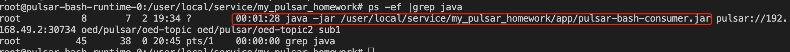
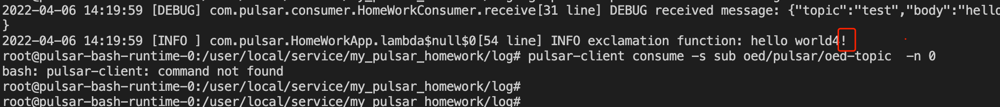

## Instructions 

#### 1. compile bash runtime

```
Use make command to compile java files and pack to jar files.

$ make clean test compile package

If the command run succeed,you would see two jars (pulsar-bash-consumer.jar and pulsar-bash-producer.jar) under the target directory.
```

#### 2. build image and push to hub

```
make image push

If you want to push image to the repo that you can access esaily, Please modify REPO parameter that locate in Makefile.
```

#### 3. Deploy bash runtime

```
Before you apply the statefulset specifation file (locate in scripts directory),if it is very important to assure that container image and env parameter is correct.

$ kubectl apply -f pulsar-bash-runtime-statefulset.yaml 
service/pulsar-bash-runtime created
statefulset.apps/pulsar-bash-runtime created


[pulsar@VM-77-237-centos ~]$ kubectl get service pulsar-bash-runtime  -n pulsar
NAME                  TYPE        CLUSTER-IP   EXTERNAL-IP   PORT(S)   AGE
pulsar-bash-runtime   ClusterIP   None         <none>        <none>    39m


[pulsar@VM-77-237-centos ~]$ kubectl get statefulset pulsar-bash-runtime  -n pulsar
NAME                  READY   AGE
pulsar-bash-runtime   1/1     38m


[pulsar@VM-77-237-centos ~]$ kubectl get pods -w -l app=pulsar-bash-runtime -n pulsar
NAME                                      READY   STATUS             RESTARTS         AGE
pulsar-bash-runtime-0                     1/1     Running            0                38m
```

#### 4. Play with pulsar bash runtime app

```
[pulsar@VM-77-237-centos ~]$ kubectl exec -it -n pulsar pulsar-bash-runtime-0 -- /bin/bash
root@pulsar-bash-runtime-0:/user/local/service/my_pulsar_homework#

If you want to send some message to pulsar,please go to bin directory and run send_message_to_pulsar.sh.
For example:
root@pulsar-bash-runtime-0:/user/local/service/my_pulsar_homework# cd bin
root@pulsar-bash-runtime-0:/user/local/service/my_pulsar_homework/bin# ./send_message_to_pulsar.sh -h
./send_message_to_pulsar.sh: illegal option -- h
Tools help

Syntax: send_message_to_pulsar.sh [-u|t|m]
options:
    u     Set pulsar service url,like: -u pulsar://192.168.49.2:32579 
    t     Set pulsar topic, like: -t oed/pulsar/my-topic
    m     Set message data, like: -m "hello world"

Example:
      ./send_message_to_pulsar.sh -u pulsar://192.168.49.2:32579 -t my-topic -m "hello world"
      


If you want to transfer message from pulsar topic to others, please run receive_then_send_to_pulsar.sh -h

root@pulsar-bash-runtime-0:/user/local/service/my_pulsar_homework/bin# ./receive_then_send_to_pulsar.sh -h
./receive_then_send_to_pulsar.sh: illegal option -- h
Tools help

Syntax: receive_then_send_to_pulsar.sh [-u|f|t|n]
options:
    u     Set pulsar service url,like: -u pulsar://192.168.49.2:32579 
    f     Set receive pulsar topic, like: -f oed/pulsar/my-topic1
    t     Set send pulsar topic, like: -t oed/pulsar/my-topic2
    n     Set subscriptionName , like: -n sub1

Example:
      ./receive_then_send_to_pulsar.sh -u pulsar://192.168.49.2:32579 -f my-topic -t my-topic -n sub1

You can find a java process had already running,this process is a demo.It transfer message to the other topics and output messages with exclamation behind them.
```




#### 5. log management

```
pulsar bush runtime output log events to pulsar-bash-runtime.log. You can get more bash runntime information from pulsar-bash-runtime.log file.

root@pulsar-bash-runtime-0:/user/local/service/my_pulsar_homework/log# ll
total 24
-rw-r--r-- 1 root root 22203 Apr  5 19:54 pulsar-bash-runtime.log
```

#### 6. consumer support multiply consumer functions
```
Consumer can support a group consumer functions, like HomeWorkConsumer
1 transfer message to other topics
2  append exclamation behind message and output to log file.

```