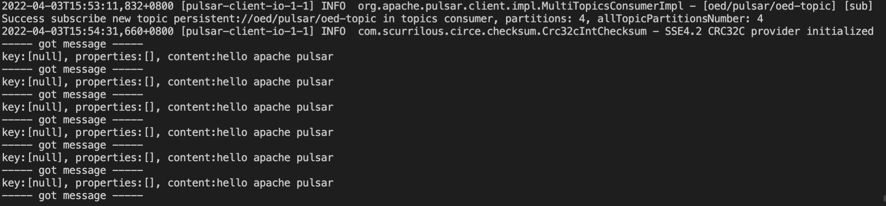

### 1 login to pulsar toolset pod

```
login to pulsar toolset pod:
kubectl exec -it -n pulsar pulsar-mini-toolset-0 -- /bin/bash
```

### 2 create tenant

```
telnet name:  oed (Online education department 在线教育)
bin/pulsar-admin tenants create oed

or you can use following script to show tenants which the pulsar cluster has managed:
bin/pulsar-admin tenants list
```

### 3 create namespace

```
bin/pulsar-admin namespaces create oed/pulsar

or you can use following script to show namespaces in current tanant(oed):
bin/pulsar-admin namespaces list oed
```

### 4 create topics

```
bin/pulsar-admin topics create-partitioned-topic oed/pulsar/oed-topic -p 4
bin/pulsar-admin topics list-partitioned-topics oed/pulsar
```

### 5 export pulsar service

```
$ kubectl get services -n pulsar | grep pulsar-mini-proxy
pulsar-mini-proxy        LoadBalancer   10.97.221.242   <pending>     80:30134/TCP,6650:32579/TCP           37m

$ minikube service pulsar-mini-proxy -n pulsar --url
http://192.168.49.2:30134 (webServiceUrl=http://192.168.49.2:30134/)
http://192.168.49.2:32579 (brokerServiceUrl=pulsar://192.168.49.2:32579/)

```

### 6 install Apache Pulsar tarball & JDK

```
1 you can download binary source from here(https://pulsar.apache.org/en/download/)
2 tar -xf apache-pulsar-2.9.1-bin.tar.gz
3 add export PULSAR_HOME=$(XXXX) to ~/.bashrc and source .bashrc and append ${PULSAR_HOME}/bin to the PATH;
4 modify webServiceUrl and brokerServiceUrl in ${PULSAR_HOME}/conf/client.conf(here,you can get values from step5)
5 install jdk
```

### 7 produce & consume

```
 start consumer:
 pulsar-client consume -s sub oed/pulsar/oed-topic  -n 0
 ```



```
 send message:
 pulsar-client produce oed/pulsar/oed-topic  -m "hello apache pulsar" -n 10

```