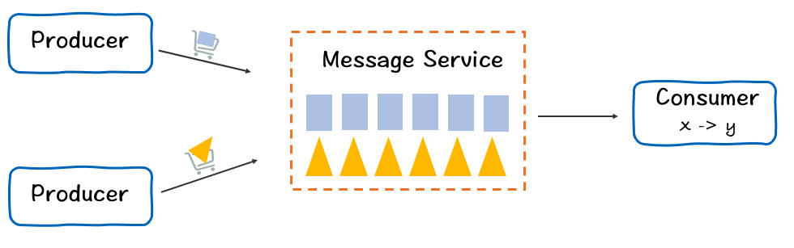
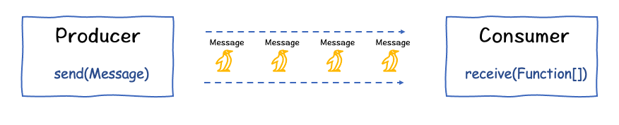

### 1. Business Role

> There are three important roles in our business(or requirements).They are producer,message service,consumer.
Producer knows how to send message to the message service(or message storage).
Message service is just third-part service.it help us store message and manage out data.It may Pulsar ,Kafka ,evently local queue.
Consumer receives message from message service and map the message to other types or transfer to other service(maybe pulsar)



### 2. Business module

> Message service is not import here.But it is our import friend.It help us store messages.
We should pay much more attention to Producer and Consumer. From requirements,we know that consumer should receive message and do some action on them(maybe map to other types or transfer to other service).
Producer just help us send message.But not know how to build a message.
Comsumer can revive message from message service and hand the message.They not focus on hand details,you should specify business strategy and then inject( or as a parameter pass) to the consumer.




### 3. How to Code
3.1 Producer
```
public interface Producer<T> extends Closeable {
    void send(T message);
}

```
3.2 HomeWorkProducer

> We should send message to Pulsar,so we need to define our own producer.But I don't want to know how to send message.I just inject pulsar producer into HomeWorkProducer.
```
public class HomeWorkProducer<T> implements Producer<T> {
    org.apache.pulsar.client.api.Producer<T> producer;
    @Override
    public void send(T message) {
         ...
    }

}
```
3.3 Consumer
```
public interface Consumer<T> extends Closeable {
    void receive(java.util.function.Consumer<T> ...fns);
}
```
3.4 HomeWorkConsumer
> Also, I inject pulsar consumer into HomeWorkConsumer.I don't want to know details about message business.User should specify business requirements in function and pass them to HomeWorkConsumer
> For example, I pass Exclamation function to HomeWorkConsumer when I call it in HomeWorkApp.
```
public class HomeWorkConsumer<T> implements Consumer<T> {
    org.apache.pulsar.client.api.Consumer<T> consumer;

    @Override
    public void receive(java.util.function.Consumer<T>... fns) {
            msg = consumer.receive();
            for (java.util.function.Consumer<T> fn : fns) {
                fn.accept(msg.getValue());
            }
            consumer.acknowledge(msg);
    }
}
```
